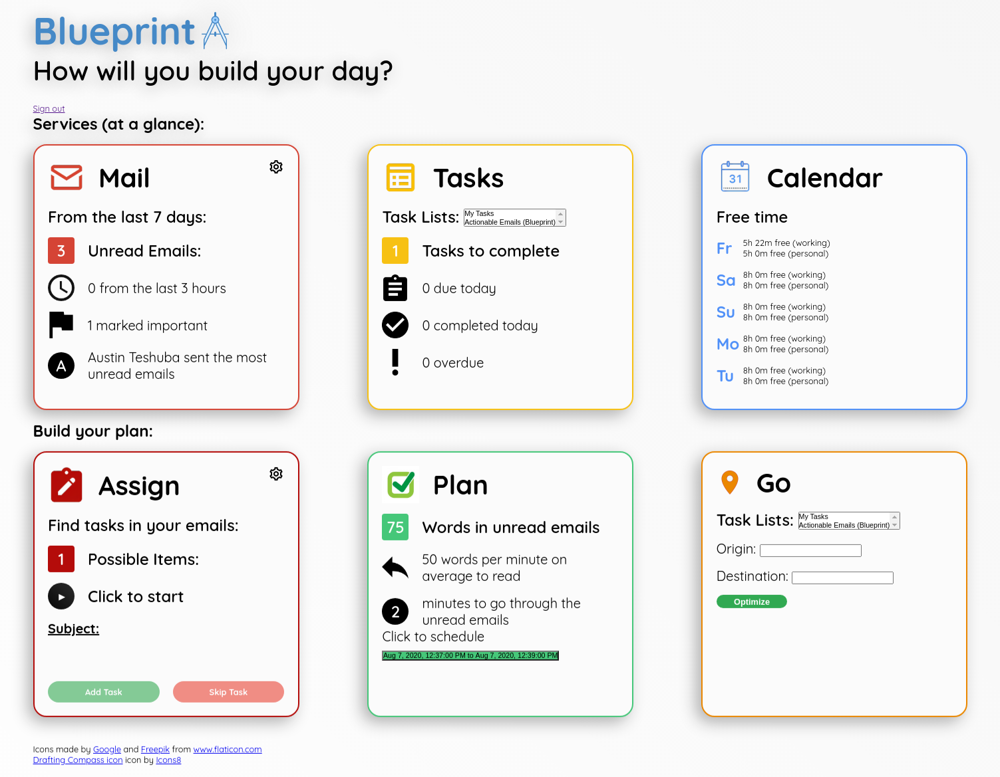

# Welcome to Blueprint
Blueprint is a centralized dashboard which introduces cross-features between our favorite Google products: Gmail, Tasks,
and Calendar. These features are designed to enhance power users’ ability to plan and work effectively.



## Key Goals and Non-goals
Blueprint synthesizes information from Gmail, Tasks, and Calendar to present useful/actionable highlights
and encourage actions between them, such as automatically creating tasks or calendar events out of emails,
automatically scheduling calendar events from tasks and finding the most efficient order of travel between different
tasks. These features, ultimately, will empower the user to easily plan how they will take action.

We are NOT aiming to simply embed multiple Google products onto a single page.
Rather, we are aiming to present summary information from each service
(i.e. You have 35 unread emails in the last 7 days vs. presenting a list of all unread emails
[which would be redundant])

We are NOT aiming to teach users who do not already use these features on a regular basis since this is targeted towards
power users.

We are NOT aiming to rewrite any existing functionality such as writing our own function to send an email,
creating our own Google Tasks, or making our own calendar.

We are NOT aiming to store any user information that might be displayed on our dashboard -
we are simply extracting useful details from the information to digest and display back to the user.
However, this could turn out to be a stretch goal if we wish to cache information to handle large amounts of data.

## Get Started
This project is configured to deploy on Google App Engine.

### Prerequisites
You must have Java 8 or above, Apache Maven, and the Google Cloud SDK installed and configured on your local machine.
Here's how to install [Maven](https://maven.apache.org/install.html), [Java](https://java.com/en/download/help/download_options.xml)
and [The Google Cloud SDK](https://cloud.google.com/sdk/install).

### Google Cloud Platform
1) To get started, begin by proceeding to [Google Cloud Console](https://console.cloud.google.com) and creating an account.

2) Proceed to "Create an Empty Project". You can give the project any name you'd like.

3) Once you've created your project, you should be provided with a "Project ID". Note that this is different than your
project name, and should be in the following format: "sample-project-id".

4) Clone this repository. In the [pom.xml](pom.xml) file, you should see the following code block:
    ```$xslt
        <groupId>com.google.sps</groupId>
        <artifactId>INSERT_PROJECT_ID_HERE</artifactId>
        <version>1</version>
        <packaging>war</packaging>
    ```
Replace the `artifactId` with your project ID.

5) In the [pom.xml](pom.xml) file, you should see the following code block:
    ```$xslt
    <plugin>
        <groupId>com.google.cloud.tools</groupId>
        <artifactId>appengine-maven-plugin</artifactId>
        <version>2.2.0</version>
    </plugin>
    ```
   Replace it with this:
   ```$xslt
   <plugin>
       <groupId>com.google.cloud.tools</groupId>
       <artifactId>appengine-maven-plugin</artifactId>
       <configuration>
           <deploy.version>1</deploy.version>
           <deploy.projectId>YOUR_PROJECT_ID</deploy.projectId>
       </configuration>
       <version>2.2.0</version>
   </plugin>
   ```
   Replace `YOUR_PROJECT_ID` with your project ID.

   It's also worth noting that setting the project ID and version during each deploy using this command also works:
   `mvn package appengine:deploy -Dapp.deploy.version=<VERSION> -Dapp.deploy..projectId=<PROJECT_ID>`
   This would remove the need for the above configuration.

### Enable APIs
To enable an API, navigate to "APIs & Services" -> "Library" -> "<The API>" and press "Enable".
Complete these steps for the following APIs:

1) Gmail API
2) Tasks API
3) Google Calendar API
4) Geocoding API
5) Places API
6) Directions API
7) Secret Manager API

### API Key Generation
1) In the `src/main/resources` directory, create a new file called `KEYS.json`. It should have the following format:
    ```$xslt
    {
      "apiKey" : "YOUR KEY",
      "clientId" : "YOUR CLIENT ID"
    }
    ```

2) In the [Google Cloud Console](https://console.cloud.google.com), navigate to "APIs and Services" -> "Credentials".

3) Click "Create Credentials", and first select "OAuth Client ID".

4) Select your Application Type as "Web Application", and select a name for the Client ID (anything is fine).

5) Add any origins you may need to the "Authorized JavaScript Origins" and "Authorized redirect URIs".
Add every URI that you anticipate using the application from (e.g. localhost:8080 (default localhost for this
project), YOUR_PROJECT_ID.appspot.com (the appengine domain), etc.)

6) Copy your project ID and place it in the pom.xml file.

7) Click "Create Credentials" again and select "API Key".

8) Copy the API Key into the pom.xml file.

### Set up the GCloud SDK (if you're new to using the GCloud SDK)
1) Run `gcloud init` and configure GCloud on your computer. When prompted, please enter the numeric choice that
corresponds to the project ID you just created.

2) Run `gcloud app create` to create an appengine project. Select any region you'd like, though it is suggested to
select a region close to you. For more information, check this [link](https://cloud.google.com/appengine/docs/locations).

### Running Application
1) Run `mvn clean install` in the project root directory

2) Run `mvn package appengine:deploy` to deploy the website

3) Navigate to "YOUR_PROJECT_ID.appspot.com". You should see a deployed version of Blueprint!
Note that the following format "YOUR_PROJECT_ID.REGION_ID.r.appspot.com" will also work.

## Contributors
A special thanks to the original creators of Blueprint, @austinteshuba, @tttzach, @AymarMuhikira, @antmar,
and @gbuenoandrade.

## Licence
This project is released under the conditions of [Apache 2.0](https://www.apache.org/licenses/LICENSE-2.0).

**This is not an officially supported Google product.**